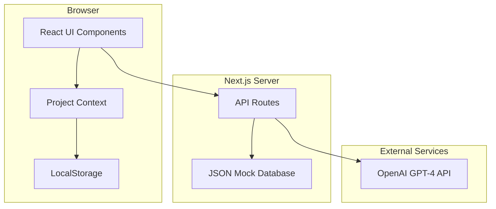
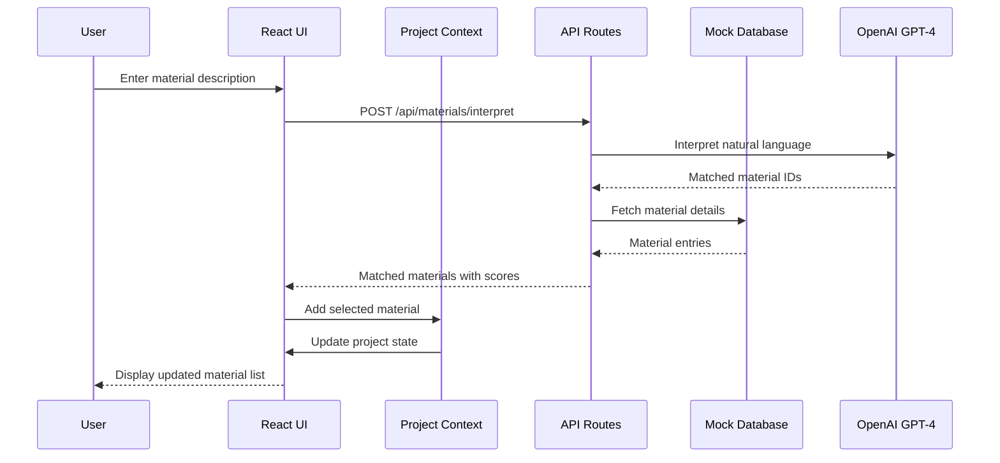

# Technical Design Document: Embodied Carbon Negotiator MVP

## Overview

The Embodied Carbon Negotiator is a web-based procurement decision-support tool for construction firms in India. This MVP enables procurement managers to compare material options by embodied carbon, optimize selections against carbon budgets and cost ceilings, and generate AI-powered negotiation briefs.

### Technical Stack

- **Frontend**: Next.js 14 with App Router, React 18, TypeScript
- **Backend**: Next.js API Routes (serverless functions)
- **AI Integration**: OpenAI GPT-4 API
- **Data Storage**: JSON files (mock database) + Browser LocalStorage (project persistence)
- **Visualization**: Recharts (React-native charting library)
- **Styling**: Tailwind CSS
- **PDF Generation**: @react-pdf/renderer
- **CSV Export**: Native JavaScript (Blob API)

### Key Technical Decisions

| Decision               | Choice                              | Rationale                                                      |
| ---------------------- | ----------------------------------- | -------------------------------------------------------------- |
| Router                 | App Router                          | Modern React patterns, server components, better data fetching |
| State Management       | React Context + useReducer          | Sufficient for MVP scope, no external dependencies             |
| Mock Database          | JSON files in `/data`               | Simple, version-controlled, easy to modify for demo            |
| Optimization Algorithm | Exhaustive enumeration with pruning | Guaranteed Pareto frontier accuracy for small datasets         |
| Chart Library          | Recharts                            | React-native, good scatter plot support, easy tooltips         |
| PDF Generation         | @react-pdf/renderer                 | Pure React, no server-side dependencies                        |

## Architecture

### System Architecture Diagram



### Request Flow



### Directory Structure

```
/
├── app/
│   ├── layout.tsx              # Root layout with providers
│   ├── page.tsx                # Landing/project list page
│   ├── project/
│   │   ├── new/
│   │   │   └── page.tsx        # Project creation form
│   │   └── [id]/
│   │       ├── page.tsx        # Project dashboard
│   │       ├── materials/
│   │       │   └── page.tsx    # Material management
│   │       ├── optimize/
│   │       │   └── page.tsx    # Optimization & Pareto view
│   │       └── report/
│   │           └── page.tsx    # Report generation
│   └── api/
│       ├── materials/
│       │   ├── route.ts        # GET materials, filter/sort
│       │   └── interpret/
│       │       └── route.ts    # POST interpret natural language
│       ├── optimize/
│       │   └── route.ts        # POST run optimization
│       ├── ai/
│       │   ├── estimate/
│       │   │   └── route.ts    # POST estimate carbon
│       │   ├── negotiate/
│       │   │   └── route.ts    # POST generate brief
│       │   ├── alternatives/
│       │   │   └── route.ts    # POST suggest alternatives
│       │   └── summary/
│       │       └── route.ts    # POST generate executive summary
│       └── demo/
│           └── route.ts        # GET load demo data
├── components/
│   ├── ui/                     # Reusable UI components
│   │   ├── Button.tsx
│   │   ├── Input.tsx
│   │   ├── Card.tsx
│   │   ├── Modal.tsx
│   │   └── Tooltip.tsx
│   ├── project/
│   │   ├── ProjectForm.tsx
│   │   ├── ProjectCard.tsx
│   │   └── ConstraintDisplay.tsx
│   ├── materials/
│   │   ├── MaterialInput.tsx
│   │   ├── MaterialList.tsx
│   │   ├── MaterialCard.tsx
│   │   ├── MaterialFilter.tsx
│   │   └── AlternativeSuggestion.tsx
│   ├── optimization/
│   │   ├── ParetoChart.tsx
│   │   ├── OptimizationResults.tsx
│   │   └── CombinationCard.tsx
│   ├── negotiation/
│   │   ├── NegotiationBrief.tsx
│   │   └── BriefControls.tsx
│   └── report/
│       ├── ReportPreview.tsx
│       ├── PDFDocument.tsx
│       └── ExportButtons.tsx
├── context/
│   └── ProjectContext.tsx      # Global project state
├── lib/
│   ├── optimization.ts         # Pareto optimization algorithm
│   ├── openai.ts              # OpenAI client wrapper
│   ├── storage.ts             # LocalStorage utilities
│   └── utils.ts               # General utilities
├── data/
│   ├── materials.json         # Mock material database
│   └── demo-project.json      # Pre-configured demo data
├── types/
│   └── index.ts               # TypeScript type definitions
└── public/
    └── ...                    # Static assets
```

## Components and Interfaces

### Core Components

#### ProjectContext

Manages global project state using React Context and useReducer pattern.

```typescript
interface ProjectContextValue {
  project: Project | null;
  materials: ProjectMaterial[];
  optimizationResult: OptimizationResult | null;
  selectedCombination: MaterialCombination | null;

  // Actions
  createProject: (data: CreateProjectInput) => void;
  loadProject: (id: string) => void;
  addMaterial: (material: ProjectMaterial) => void;
  removeMaterial: (materialId: string) => void;
  updateMaterialQuantity: (materialId: string, quantity: number) => void;
  setOptimizationResult: (result: OptimizationResult) => void;
  selectCombination: (combination: MaterialCombination) => void;
  loadDemo: () => void;
}
```

#### ParetoChart

Interactive scatter plot visualization for cost-carbon tradeoffs.

```typescript
interface ParetoChartProps {
  combinations: MaterialCombination[];
  paretoFrontier: MaterialCombination[];
  carbonBudget: number;
  costCeiling: number;
  selectedCombination: MaterialCombination | null;
  onSelectCombination: (combination: MaterialCombination) => void;
}
```

#### MaterialInput

Natural language material input with AI interpretation.

```typescript
interface MaterialInputProps {
  onMaterialSelected: (material: ProjectMaterial) => void;
  existingMaterials: ProjectMaterial[];
}
```

### API Route Interfaces

#### POST /api/materials/interpret

Interprets natural language material descriptions using GPT-4.

```typescript
// Request
interface InterpretRequest {
  description: string;
  projectContext?: {
    existingMaterials: string[];
    category?: string;
  };
}

// Response
interface InterpretResponse {
  matches: Array<{
    material: MaterialEntry;
    confidenceScore: number;
    matchReason: string;
  }>;
  suggestions?: string[];
}
```

#### POST /api/optimize

Runs the cost-carbon optimization algorithm.

```typescript
// Request
interface OptimizeRequest {
  materials: ProjectMaterial[];
  carbonBudget: number;
  costCeiling: number;
}

// Response
interface OptimizeResponse {
  combinations: MaterialCombination[];
  paretoFrontier: MaterialCombination[];
  feasibleCount: number;
  totalCombinations: number;
  executionTimeMs: number;
  baseline: {
    totalCost: number;
    totalCarbon: number;
  };
}
```

#### POST /api/ai/negotiate

Generates supplier negotiation briefs.

```typescript
// Request
interface NegotiateRequest {
  supplier: SupplierInfo;
  selectedMaterials: ProjectMaterial[];
  competitorData: SupplierComparison[];
  priority: "cost" | "carbon" | "balanced";
}

// Response
interface NegotiateResponse {
  brief: NegotiationBrief;
  generatedAt: string;
}
```

#### POST /api/ai/estimate

Estimates carbon footprint for materials without EPD data.

```typescript
// Request
interface EstimateRequest {
  materialName: string;
  category: string;
  supplierRegion: string;
}

// Response
interface EstimateResponse {
  estimatedCarbon: number;
  confidence: "high" | "medium" | "low";
  referenceMaterials: Array<{
    name: string;
    carbon: number;
  }>;
  methodology: string;
}
```

## Data Models

### Core Types

```typescript
// Material from the mock database
interface MaterialEntry {
  id: string;
  name: string;
  category:
    | "steel"
    | "cement"
    | "insulation"
    | "glass"
    | "aggregates"
    | "timber";
  suppliers: SupplierOption[];
  unit: "kg" | "m²" | "m³" | "pieces";
  description: string;
}

interface SupplierOption {
  id: string;
  name: string;
  unitPrice: number; // INR
  embodiedCarbon: number; // kgCO2e per unit
  region: string;
  hasEPD: boolean;
  estimatedCarbon?: {
    value: number;
    confidence: "high" | "medium" | "low";
    referenceIds: string[];
  };
}

// Project configuration
interface Project {
  id: string;
  name: string;
  carbonBudget: number; // kgCO2e
  costCeiling: number; // INR
  createdAt: string;
  updatedAt: string;
}

// Material added to a project
interface ProjectMaterial {
  id: string;
  materialId: string;
  materialName: string;
  category: string;
  selectedSupplierId: string;
  supplierName: string;
  quantity: number;
  unit: string;
  unitPrice: number;
  embodiedCarbon: number;
  isEstimated: boolean;
  totalCost: number; // quantity * unitPrice
  totalCarbon: number; // quantity * embodiedCarbon
}

// Optimization result types
interface MaterialCombination {
  id: string;
  selections: Array<{
    materialId: string;
    supplierId: string;
    supplierName: string;
    quantity: number;
    cost: number;
    carbon: number;
  }>;
  totalCost: number;
  totalCarbon: number;
  isFeasible: boolean;
  isOnParetoFrontier: boolean;
  costSavings: number; // vs baseline
  carbonSavings: number; // vs baseline
}

interface OptimizationResult {
  combinations: MaterialCombination[];
  paretoFrontier: MaterialCombination[];
  baseline: MaterialCombination;
  feasibleCount: number;
  executionTimeMs: number;
}

// Negotiation types
interface NegotiationBrief {
  supplierId: string;
  supplierName: string;
  talkingPoints: string[];
  carbonComparison: {
    supplierCarbon: number;
    categoryAverage: number;
    percentile: number;
  };
  strategies: string[];
  volumeDiscountOpportunity: string;
  carbonImprovementSuggestions: string[];
  priority: "cost" | "carbon" | "balanced";
}

// Alternative suggestion types
interface AlternativeSuggestion {
  currentMaterial: ProjectMaterial;
  alternative: MaterialEntry;
  alternativeSupplier: SupplierOption;
  carbonSavings: number;
  carbonSavingsPercent: number;
  costDifference: number;
  costDifferencePercent: number;
  explanation: string;
}

// Report types
interface ProcurementReport {
  project: Project;
  selectedMaterials: ProjectMaterial[];
  totalCost: number;
  totalCarbon: number;
  costSavings: number;
  carbonSavings: number;
  executiveSummary: string;
  categoryBreakdown: Array<{
    category: string;
    cost: number;
    carbon: number;
    percentage: number;
  }>;
  comparisonTable: Array<{
    material: string;
    selected: { supplier: string; cost: number; carbon: number };
    baseline: { supplier: string; cost: number; carbon: number };
  }>;
  metricsPerSqm: {
    costPerSqm: number;
    carbonPerSqm: number;
    assumedArea: number;
  };
}
```

### Mock Database Schema (materials.json)

```json
{
  "materials": [
    {
      "id": "steel-001",
      "name": "TMT Steel Bars Fe500D",
      "category": "steel",
      "unit": "kg",
      "description": "High-strength thermo-mechanically treated steel bars for reinforcement",
      "suppliers": [
        {
          "id": "sup-tata-001",
          "name": "Tata Steel",
          "unitPrice": 65,
          "embodiedCarbon": 2.1,
          "region": "Jamshedpur",
          "hasEPD": true
        },
        {
          "id": "sup-jsw-001",
          "name": "JSW Steel",
          "unitPrice": 62,
          "embodiedCarbon": 2.3,
          "region": "Bellary",
          "hasEPD": true
        }
      ]
    }
  ],
  "metadata": {
    "version": "1.0.0",
    "lastUpdated": "2024-01-15",
    "totalMaterials": 60,
    "categories": [
      "steel",
      "cement",
      "insulation",
      "glass",
      "aggregates",
      "timber"
    ]
  }
}
```

### LocalStorage Schema

```typescript
interface LocalStorageSchema {
  // Key: 'ecn_projects'
  projects: Array<{
    project: Project;
    materials: ProjectMaterial[];
    lastOptimization?: OptimizationResult;
    selectedCombinationId?: string;
  }>;

  // Key: 'ecn_active_project'
  activeProjectId: string | null;
}
```

### Demo Project Data (demo-project.json)

```json
{
  "project": {
    "id": "demo-bangalore-10story",
    "name": "10-Story Residential Building - Bangalore",
    "carbonBudget": 500000,
    "costCeiling": 50000000,
    "createdAt": "2024-01-15T00:00:00Z",
    "updatedAt": "2024-01-15T00:00:00Z"
  },
  "materials": [
    {
      "materialId": "steel-001",
      "category": "steel",
      "quantity": 150000,
      "description": "Structural steel for framework"
    },
    {
      "materialId": "cement-001",
      "category": "cement",
      "quantity": 2000,
      "description": "Portland cement for concrete"
    }
  ],
  "assumedBuildingArea": 10000
}
```

## Correctness Properties

_A property is a characteristic or behavior that should hold true across all valid executions of a system—essentially, a formal statement about what the system should do. Properties serve as the bridge between human-readable specifications and machine-verifiable correctness guarantees._

### Property 1: Positive Number Validation

_For any_ numeric input value, the validation function SHALL accept the value if and only if it is a positive number (greater than zero). Non-positive numbers (zero, negative) and non-numeric values SHALL be rejected.

**Validates: Requirements 1.4, 1.5**

### Property 2: Project Persistence Round-Trip

_For any_ valid Project object, saving it to localStorage and then loading it back SHALL return a Project object with equivalent values for all fields (id, name, carbonBudget, costCeiling, createdAt, updatedAt).

**Validates: Requirements 1.7**

### Property 3: Material Interpretation Results Ordering

_For any_ material interpretation API response containing multiple matches, the matches SHALL be sorted in descending order by confidence score (highest confidence first).

**Validates: Requirements 2.4**

### Property 4: Material List Addition Invariant

_For any_ valid material selection and existing project material list, adding the material to the list SHALL increase the list length by exactly one, and the resulting list SHALL contain the added material.

**Validates: Requirements 2.6**

### Property 5: Material Entry Schema Completeness

_For any_ MaterialEntry in the database, the entry SHALL have all required fields present and valid: id (non-empty string), name (non-empty string), category (one of the six valid categories), unit (valid unit type), and at least one supplier with all required supplier fields.

**Validates: Requirements 3.5**

### Property 6: Material Filter Correctness

_For any_ filter criteria (category, carbon range, price range) applied to the material database, all returned materials SHALL match the specified filter conditions. No material that fails any filter condition SHALL be included in the results.

**Validates: Requirements 3.7**

### Property 7: Material Sort Correctness

_For any_ sort criteria (price, carbon, or supplier name) applied to a list of materials, the returned list SHALL be in the correct order according to the sort field and direction. For any two adjacent items in the sorted list, the first item's sort value SHALL be less than or equal to (ascending) or greater than or equal to (descending) the second item's sort value.

**Validates: Requirements 3.8**

### Property 8: Optimization Combination Completeness

_For any_ set of N materials where material i has S_i supplier options, the optimization engine SHALL evaluate exactly ∏(S_i) total combinations (the product of all supplier counts).

**Validates: Requirements 5.1**

### Property 9: Feasibility Constraint Satisfaction

_For any_ MaterialCombination marked as feasible (isFeasible = true), the combination's totalCost SHALL be less than or equal to the project's costCeiling AND the combination's totalCarbon SHALL be less than or equal to the project's carbonBudget.

**Validates: Requirements 5.2**

### Property 10: Pareto Frontier Non-Dominance

_For any_ two distinct points A and B on the Pareto frontier, neither point SHALL dominate the other. Point A dominates point B if and only if A.totalCost ≤ B.totalCost AND A.totalCarbon ≤ B.totalCarbon AND at least one inequality is strict.

**Validates: Requirements 5.3**

### Property 11: Feasible Combinations Ranking

_For any_ optimization result, the feasible combinations SHALL be sorted in descending order by their weighted score (combining cost savings and carbon savings).

**Validates: Requirements 5.5**

### Property 12: Project Totals Recalculation Invariant

_For any_ project with a list of materials, the project's totalCost SHALL equal the sum of all materials' (quantity × unitPrice), and the project's totalCarbon SHALL equal the sum of all materials' (quantity × embodiedCarbon).

**Validates: Requirements 8.6**

### Property 13: Alternative Suggestions Prioritization

_For any_ list of alternative material suggestions, alternatives that maintain or improve cost (costDifference ≤ 0) while reducing carbon (carbonSavings > 0) SHALL appear before alternatives that increase cost.

**Validates: Requirements 8.7**

### Property 14: Category Breakdown Sum Invariant

_For any_ procurement report, the sum of carbon values across all category breakdowns SHALL equal the report's totalCarbon value (within floating-point tolerance).

**Validates: Requirements 9.7**

### Property 15: Per-Square-Meter Metrics Calculation

_For any_ procurement report with an assumed building area > 0, the costPerSqm SHALL equal totalCost / assumedArea and carbonPerSqm SHALL equal totalCarbon / assumedArea.

**Validates: Requirements 9.8**

## Error Handling

### Client-Side Errors

| Error Scenario           | Handling Strategy                | User Feedback                                       |
| ------------------------ | -------------------------------- | --------------------------------------------------- |
| Invalid project input    | Form validation with Zod         | Inline error messages on invalid fields             |
| LocalStorage full        | Catch quota exceeded error       | Toast notification suggesting data cleanup          |
| LocalStorage unavailable | Fallback to session state        | Warning banner about data not persisting            |
| Chart rendering failure  | Error boundary with fallback     | "Unable to render chart" message with retry button  |
| PDF generation failure   | Try-catch with user notification | Toast with option to retry or export as CSV instead |

### API Errors

| Error Scenario        | HTTP Status | Response Format                                                  | Client Handling                     |
| --------------------- | ----------- | ---------------------------------------------------------------- | ----------------------------------- |
| Invalid request body  | 400         | `{ error: string, details: ValidationError[] }`                  | Display validation errors           |
| Material not found    | 404         | `{ error: "Material not found", materialId: string }`            | Show "material unavailable" message |
| OpenAI API failure    | 502         | `{ error: "AI service unavailable", fallback: boolean }`         | Offer manual selection fallback     |
| OpenAI rate limit     | 429         | `{ error: "Rate limited", retryAfter: number }`                  | Show countdown, auto-retry          |
| Optimization timeout  | 408         | `{ error: "Optimization timeout", partial: OptimizationResult }` | Show partial results with warning   |
| Internal server error | 500         | `{ error: "Internal error", requestId: string }`                 | Generic error with support contact  |

### OpenAI API Error Handling

```typescript
async function callOpenAI(prompt: string, fallbackFn?: () => any) {
  try {
    const response = await openai.chat.completions.create({
      model: "gpt-4",
      messages: [{ role: "user", content: prompt }],
      timeout: 30000,
    });
    return response.choices[0].message.content;
  } catch (error) {
    if (error.status === 429) {
      // Rate limited - wait and retry once
      await sleep(error.headers["retry-after"] * 1000);
      return callOpenAI(prompt, fallbackFn);
    }
    if (fallbackFn) {
      return fallbackFn();
    }
    throw new AIServiceError("OpenAI service unavailable", error);
  }
}
```

### Graceful Degradation

When AI services are unavailable:

1. **Material Interpretation**: Fall back to keyword-based search against material names and descriptions
2. **Carbon Estimation**: Display "Estimation unavailable" with option to enter manual value
3. **Negotiation Briefs**: Provide template-based brief with placeholders for AI-generated content
4. **Alternative Suggestions**: Show materials in same category sorted by carbon footprint
5. **Executive Summary**: Generate basic template summary from structured data

## Testing Strategy

### Unit Tests

Unit tests focus on specific examples, edge cases, and component behavior:

- **Validation functions**: Test boundary values (0, negative, very large numbers)
- **Data transformations**: Test specific input/output examples
- **Component rendering**: Test that components render with expected props
- **LocalStorage utilities**: Test save/load with mock storage
- **Utility functions**: Test formatting, calculations with known values

### Property-Based Tests

Property-based tests verify universal properties across generated inputs. Each property test runs minimum 100 iterations.

**Testing Library**: fast-check (TypeScript property-based testing)

| Property                                   | Test File                       | Generators                                                           |
| ------------------------------------------ | ------------------------------- | -------------------------------------------------------------------- |
| Property 1: Positive Number Validation     | `validation.property.test.ts`   | `fc.double()`, `fc.integer()`                                        |
| Property 2: Project Persistence Round-Trip | `storage.property.test.ts`      | `fc.record({ name: fc.string(), ... })`                              |
| Property 3: Results Ordering               | `api.property.test.ts`          | `fc.array(fc.record({ confidenceScore: fc.double() }))`              |
| Property 4: Material List Addition         | `state.property.test.ts`        | `fc.array(projectMaterialArb), projectMaterialArb`                   |
| Property 5: Schema Completeness            | `database.property.test.ts`     | Load actual database entries                                         |
| Property 6: Filter Correctness             | `filter.property.test.ts`       | `fc.record({ category, carbonRange, priceRange })`                   |
| Property 7: Sort Correctness               | `sort.property.test.ts`         | `fc.array(materialArb), fc.constantFrom('price', 'carbon', 'name')`  |
| Property 8: Combination Completeness       | `optimization.property.test.ts` | `fc.array(materialWithSuppliersArb, { minLength: 1, maxLength: 5 })` |
| Property 9: Feasibility Satisfaction       | `optimization.property.test.ts` | Generated combinations with constraints                              |
| Property 10: Pareto Non-Dominance          | `optimization.property.test.ts` | Generated Pareto frontiers                                           |
| Property 11: Feasible Ranking              | `optimization.property.test.ts` | Generated feasible combinations                                      |
| Property 12: Totals Recalculation          | `state.property.test.ts`        | `fc.array(projectMaterialArb)`                                       |
| Property 13: Alternative Prioritization    | `alternatives.property.test.ts` | `fc.array(alternativeArb)`                                           |
| Property 14: Category Breakdown Sum        | `report.property.test.ts`       | Generated reports with categories                                    |
| Property 15: Per-Sqm Metrics               | `report.property.test.ts`       | `fc.record({ totalCost, totalCarbon, area })`                        |

### Integration Tests

Integration tests verify API routes and external service interactions:

- **Material interpretation API**: Test with representative natural language inputs
- **Optimization API**: Test with various material configurations
- **AI endpoints**: Test with mocked OpenAI responses
- **Demo data loading**: Verify demo project loads correctly

### End-to-End Tests

E2E tests verify complete user workflows:

1. **Project creation flow**: Create project → verify dashboard
2. **Material addition flow**: Enter description → select match → verify list
3. **Optimization flow**: Add materials → run optimization → view Pareto chart → select combination
4. **Report generation flow**: Select shortlist → generate report → export PDF/CSV
5. **Demo scenario**: Load demo → run optimization → generate briefs → export report

### Test Configuration

```typescript
// jest.config.js
module.exports = {
  testEnvironment: "jsdom",
  setupFilesAfterEnv: ["<rootDir>/jest.setup.ts"],
  testMatch: ["**/*.test.ts", "**/*.test.tsx", "**/*.property.test.ts"],
  collectCoverageFrom: [
    "lib/**/*.ts",
    "components/**/*.tsx",
    "app/api/**/*.ts",
  ],
  coverageThreshold: {
    global: {
      branches: 70,
      functions: 70,
      lines: 70,
      statements: 70,
    },
  },
};
```

### Property Test Example

```typescript
// lib/__tests__/optimization.property.test.ts
import fc from "fast-check";
import { findParetoFrontier, checkFeasibility } from "../optimization";

describe("Optimization Properties", () => {
  // Feature: embodied-carbon-negotiator, Property 10: Pareto Frontier Non-Dominance
  it("Pareto frontier points do not dominate each other", () => {
    fc.assert(
      fc.property(
        fc.array(
          fc.record({
            id: fc.uuid(),
            totalCost: fc.double({ min: 0, max: 100000000 }),
            totalCarbon: fc.double({ min: 0, max: 1000000 }),
          }),
          { minLength: 2, maxLength: 50 },
        ),
        (combinations) => {
          const frontier = findParetoFrontier(combinations);

          for (let i = 0; i < frontier.length; i++) {
            for (let j = i + 1; j < frontier.length; j++) {
              const a = frontier[i];
              const b = frontier[j];

              // Neither should dominate the other
              const aDominatesB =
                a.totalCost <= b.totalCost &&
                a.totalCarbon <= b.totalCarbon &&
                (a.totalCost < b.totalCost || a.totalCarbon < b.totalCarbon);
              const bDominatesA =
                b.totalCost <= a.totalCost &&
                b.totalCarbon <= a.totalCarbon &&
                (b.totalCost < a.totalCost || b.totalCarbon < a.totalCarbon);

              expect(aDominatesB).toBe(false);
              expect(bDominatesA).toBe(false);
            }
          }
        },
      ),
      { numRuns: 100 },
    );
  });

  // Feature: embodied-carbon-negotiator, Property 9: Feasibility Constraint Satisfaction
  it("feasible combinations satisfy both constraints", () => {
    fc.assert(
      fc.property(
        fc.record({
          totalCost: fc.double({ min: 0, max: 100000000 }),
          totalCarbon: fc.double({ min: 0, max: 1000000 }),
        }),
        fc.double({ min: 1, max: 100000000 }), // costCeiling
        fc.double({ min: 1, max: 1000000 }), // carbonBudget
        (combination, costCeiling, carbonBudget) => {
          const isFeasible = checkFeasibility(
            combination,
            costCeiling,
            carbonBudget,
          );

          if (isFeasible) {
            expect(combination.totalCost).toBeLessThanOrEqual(costCeiling);
            expect(combination.totalCarbon).toBeLessThanOrEqual(carbonBudget);
          }
        },
      ),
      { numRuns: 100 },
    );
  });
});
```

This paste expires in <1 hour. Public IP access. Share whatever you see with others in seconds with Context. Terms of ServiceReport this
